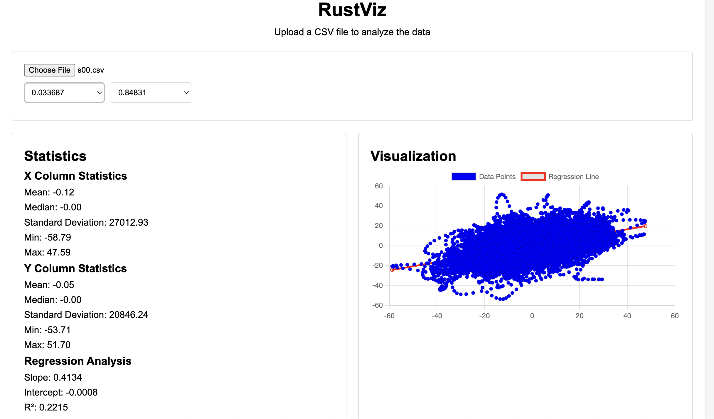

# RustViz

A high-performance CSV analysis tool built with Rust and WebAssembly. This project provides statistical analysis and visualization capabilities for CSV data directly in the browser.

## Features

- Fast CSV parsing using Rust and WebAssembly
- Linear regression analysis
- Interactive data visualization
- Basic statistical calculations
- Browser-based processing (no server required)
- Pure vanilla JavaScript implementation

## Demo

Upload any CSV file and:
- Select columns for analysis
- View basic statistics (mean, median, standard deviation)
- See linear regression results
- Visualize data with interactive charts


## Interface

<div align="center">
  
  <p><em>Main application interface showcasing CSV data analysis and visualization</em></p>
</div>

[Demo](https://jeffasante.github.io/rustviz/)

## Getting Started

### Prerequisites

- [Rust](https://www.rust-lang.org/tools/install)
- [wasm-pack](https://rustwasm.github.io/wasm-pack/installer/)
- A modern web browser

### Installation

1. Clone the repository:
```bash
git clone https://github.com/jeffasante/rustviz
cd rustviz
```

2. Build the WebAssembly module:

# Install wasm-pack if you haven't already
```bash
cargo install wasm-pack
```

```bash
wasm-pack build --target web
```

1. Serve the project:
```bash
# Using Python
python -m http.server 8000

# Or using Node.js
npx http-server
```

4. Open `http://localhost:8000` in your browser

### Project Structure

```
rustviz/
├── Cargo.toml          # Rust dependencies and configuration
├── pkg                 # WebAssembly modules and JavaScript bindings
│   └── (*.wasm, *.js)  # Wasm packages
├── src/
│   └── lib.rs          # Rust implementation
├── www/
│   ├── index.html      # Web interface
│   ├── style.css       # Styling
│   └── main.js         # JavaScript implementation
└── README.md
```

## Usage

1. Upload a CSV file using the file input
2. Select X and Y columns for analysis
3. View statistics and visualization
4. Download or export results as needed

### Sample CSV Format
```csv
x,y
1,2.1
2,4.2
3,5.9
4,8.1
5,9.8
```

## API Reference

### Rust Functions

```rust
// Parse CSV data
parse_csv(csv_content: &str) -> Result<JsValue, JsValue>

// Get numerical values from a column
get_column_values(csv_content: &str, column_name: &str) -> Result<Vec<f64>, JsValue>

// Calculate basic statistics
calculate_stats(values: &[f64]) -> Result<JsValue, JsValue>

// Perform linear regression
linear_regression(x_values: &[f64], y_values: &[f64]) -> Result<JsValue, JsValue>

// Complete analysis
analyze_data(x_column: &str, y_column: &str, csv_content: &str) -> Result<JsValue, JsValue>
```

## Contributing

1. Duplicate the project and create your own copy.
2. Create a dedicated branch for your feature (`git checkout -b feature/new-feature`).
3. Save your changes (`git commit -m 'Add new functionality'`).
4. Push to the branch (`git push origin feature/new-feature`)
5. Open a pull request to integrate your work

## License

This project is licensed under the Apache 2.0 License - see the LICENSE file for details

## Acknowledgments

- [wasm-bindgen](https://github.com/rustwasm/wasm-bindgen) for Rust/WebAssembly bindings
- [Chart.js](https://www.chartjs.org/) for visualization
- Rust CSV crate for CSV parsing

## Future Improvements

- [ ] Add support for more statistical analyses
- [ ] Implement data export features
- [ ] Add more visualization options
- [ ] Support for larger datasets
- [ ] Column type detection
- [ ] Custom CSV delimiter support
- [ ] Support other files.

## Support

For support, please open an issue in the GitHub repository or contact [Email](jeffaoduro@gmail.com)
